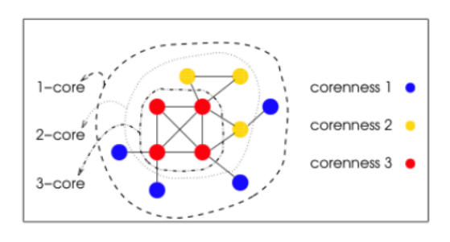

Here are some additional descriptions for these three algorithms of this homework.

## Conductance

In graph theory, the conductance of  a cut $(S,\bar{S})$ in a graph is defined as:

$$
\varphi(S)=\frac{\sum_{i\in S,j\in \bar{S}}a_{ij}}{min(a(S),a(\bar{S}))}
$$
Where the $a_{ij}$ are the entries of the adjacency matrix for *G*, so that a(S) is the total number (or weight) of the edges incident with *S*. $a(S)=\sum_{i\in S}\sum_{j\in V}a_{ij}$

In this assignment, you can classifies edges into two categories, by the lowest bit value of the source vertex. Given a edge e(u, v) , it's red if $u\And1 != 0$, otherwise is black. A edge is crossover, if its source and target vertices belong to different categories. 

So, the conductance value of a graph need be calculated in this assignment is:

$$
conductance=\frac{\# crosssover\ edges}{min\{|\#red\ edges|, |\#black\ edges|\}}
$$

## k-Cores

A k-core of a graph G is a maximal connected subgraph of G in which all vertices have degree at least k (the degree here is the degree in the final subgraph). Equivalently, it is one of the connected components of the subgraph of G formed by repeatedly deleting all vertices of degree less than k. If a non-empty k-core exists, then, clearly, G has degeneracy at least k, and the degeneracy of G is the largest k for which G has a k-core. 

Here is a example:

You can read the wiki for more detailed information of k-core.

https://en.wikipedia.org/wiki/Degeneracy_(graph_theory)

In this assignment, you can implement this algorithm in two ways:

1. Your code is used to calculate the coreness value of all vertices. And output the largest coreness value.
2. Your program need a parameter called $k$, and return or output vertices whose coreness values is greater than or equal to $k$.

The input graph of k-core algorithm need be undirected. You can treat the input directed graph as undirected during computation, or you can use tools to transform the directed graph into undirected graph. You should describe the method you use in report. 

## PageRank-Delta

PageRank-Delta is similar to PageRank, but only update vertices whose PageRank value has changed by more than some Δ-fraction.

In this assignment, each iteration of PageRank Delta:

$$
Rank(A)=Rank(A)+Delta(A)\\
Delta(A)=0.85*(\frac{Delta(B)}{L(B)}+\frac{Delta(C)}{L(C)}+...)
$$
where $Delta(A)$ is added, if $\frac{Delta(A)}{Rank(A)}$ is larger than *propagation_threshold*.

You can check https://chhzh123.github.io/blogs/2020-04-06-pagerank-delta/ for initialization details of this algorithm. 

